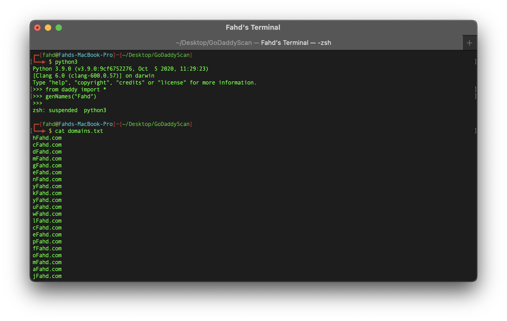
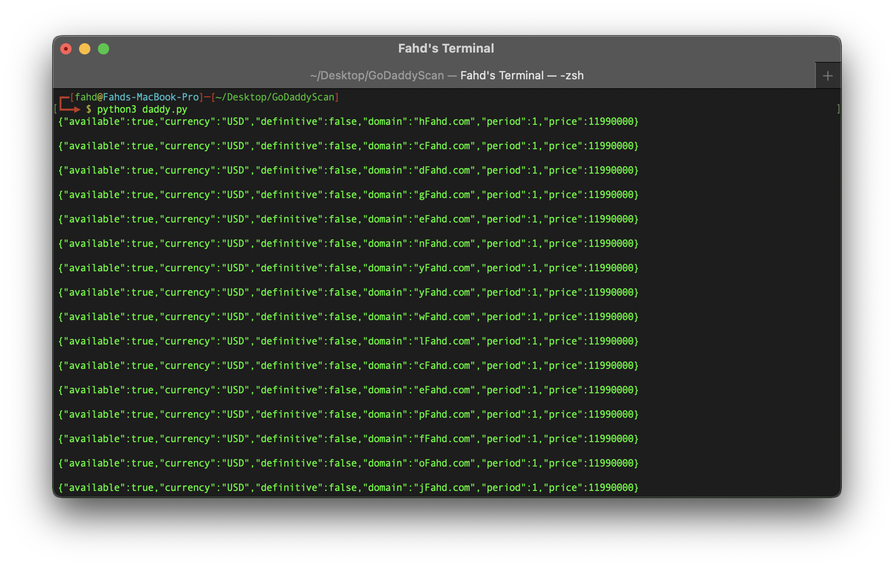

# GODADDY SCAN

Precisely generate and find availability & prices of domain names.

* Generation of domain names list through calling method to generate file with desired parameters.


* Utilizing the script to test all the domains generated in the file for availability.


## Description
This python module aims to be utilized as a script in conjunction with the GoDaddy API to take advantage of mass domain name availability checking. The following module allows for the generation of short or long unique domain names which can be tested for availability. Helpful for businesses and individuals looking to find a unique business or commercial domain name for free, through the power of python request automation.

## Getting Started

### Dependencies

* Python requests & random module.
* Your own GoDaddy API key & secret. 

### Installing
* Download the file or clone the repo.

```
git clone https://github.com/cfahd/godaddyscan.git
```

### Executing program

* In the terminal shell change your current directory to the location of the file.
* To create the domains list text file, get into an python shell in your current directory & import the module as shown in image 1, then use the genNames function with necessary parameters to generate the file.
* Run the Python file using the command below.
```
python daddy.py
```

## Authors

Contributors names and contact info

Developer: [@cFahd](https://github.com/cfahd/)

## Version History

* 0.2
    * Various bug fixes and optimizations
    * See [commit change]() or See [release history]()
* 0.1
    * Initial Release

## License

This project is licensed under the cFahd License - see the LICENSE.md file for details

